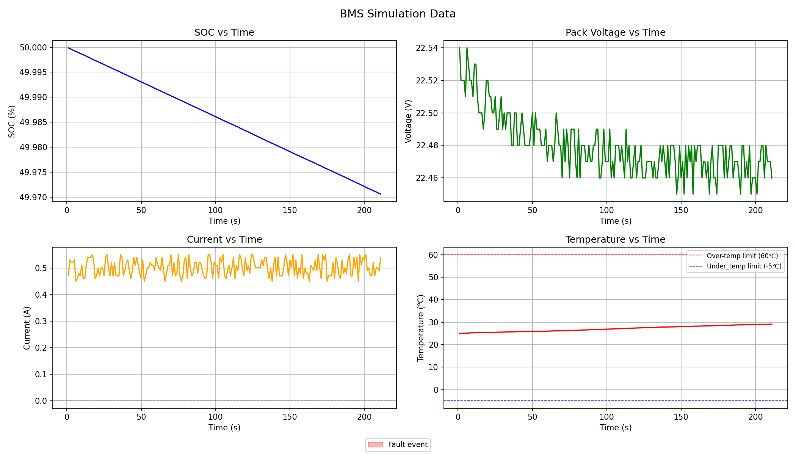
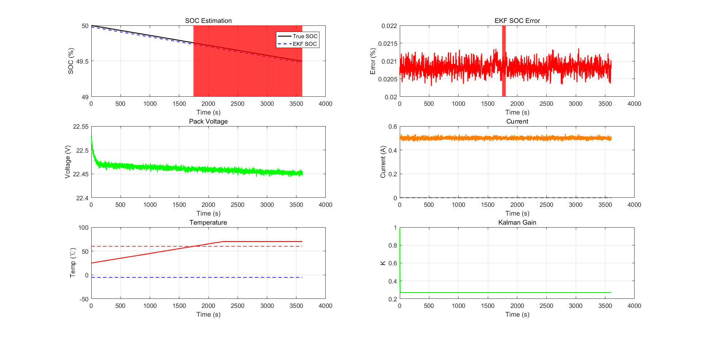

# BMS 仿真项目

基于 C 语言实现的电池管理系统（BMS）仿真，模拟真实电池行为，包含 SOC 估算、故障检测和状态管理功能。同时包含 Python LSTM 数据驱动 SOC 预测pipeline，与 EKF 实现形成对比研究。

## 项目结构

```
BMS_SimulationProject/
├── src/                  # 源文件 (.c)
│   ├── battery.c         # 电池传感器仿真（RC 等效电路）
│   ├── soc.c             # SOC 估算（库仑积分 + OCV 修正）
│   ├── state_machine.c   # 状态机（待机/充电/放电/故障）
│   ├── fault.c           # 故障检测与锁存机制
│   ├── control.c         # MOS 管控制输出
│   ├── logger.c          # CSV 数据记录器
│   ├── rc_model.c        # 一阶 RC 等效电路模型
│   └── ocv.c             # OCV-SOC 查找表（含线性插值）
├── inc/                  # 头文件 (.h)
│   ├── bms.h             # 核心数据结构与枚举定义
│   ├── battery.h
│   ├── soc.h
│   ├── state_machine.h
│   ├── fault.h
│   ├── control.h
│   ├── logger.h
│   ├── rc_model.h
│   └── ocv.h
├── lstm_soc/             # Python LSTM SOC 估算pipeline
│   ├── 1_explore_data.py    # 数据探索与可视化
│   ├── 2_preprocess.py      # 数据清洗、归一化、序列构建
│   ├── 3_train_lstm.py      # LSTM 模型定义与训练
│   └── 4_evaluate_predict.py # 模型评估与在线推理接口
│   └── results/
│   ├── data_overview.png
│   ├── training_history.png
│   └── prediction_result.png
├── main.c                # 主循环
├── plot_bms_update.py    # Python 可视化脚本
├── BMS_SimulationProject.m
├── bms_simulation.png    # C 仿真结果图
└── bms_simulation_matlab.png  # MATLAB 仿真结果图
```

## 功能特性

### C 语言 BMS 仿真
- **RC 等效电路模型**：一阶 RC 模型仿真真实电池端电压行为，用物理意义明确的值替代随机传感器数据
- **SOC 估算**：扩展卡尔曼滤波器（EKF），融合库仑积分与 OCV 查找表修正，含 R0 和 V_RC 补偿
- **OCV-SOC 查找表**：基于 18650 标准 OCV 曲线，11 个数据点线性插值
- **故障检测**：实时监测 7 种故障类型
  - 单体过压 / 欠压
  - 过温 / 欠温
  - 充电 / 放电过流
  - 单体不均衡
- **故障锁存机制**：故障触发后锁存，需满足条件后结合迟滞和稳定计时器自动复位
- **状态机**：4 种状态（待机 / 充电 / 放电 / 故障），具有明确的转换逻辑
- **CSV 数据记录器**：实时记录并 fflush 刷新，保证数据完整性
- **Python 可视化**：四图联动显示 SOC、电压、电流、温度，并标注故障事件
- **MATLAB 仿真**：EKF SOC 估算验证，含真实 SOC 对比、误差分析与六图可视化

### LSTM SOC 估算 Pipeline
- **数据探索** (`1_explore_data.py`)：加载 C 仿真输出的 CSV 文件，打印统计摘要，检查缺失值，生成 SOC、pack 电压、电流、温度四图可视化
- **数据预处理** (`2_preprocess.py`)：清除异常数据，对输入特征（pack 电压、电流、温度）和 SOC 标签分别进行 MinMaxScaler 归一化，构建滑动窗口时序序列（默认窗口长度 30 步），按 7:1.5:1.5 划分训练/验证/测试集，并将归一化器保存为 `.pkl` 文件供推理复用
- **模型训练** (`3_train_lstm.py`)：搭建双层 LSTM 网络（64→32 单元），含 Dropout 正则化和 Dense 输出层，使用 Adam 优化器和 MSE 损失函数，结合 EarlyStopping 和 ModelCheckpoint 回调训练，并绘制训练/验证损失曲线
- **评估与推理** (`4_evaluate_predict.py`)：加载已保存的模型和归一化器，在测试集上计算 MAE 和 RMSE，可视化预测值与真实 SOC 的对比，并提供 `predict_soc()` 函数，输入最近的传感器数据 DataFrame 即可实时输出 SOC 预测值

## SOC 估算误差对比

| 方法 | 误差 |
|------|------|
| 直接 OCV 查表（无补偿） | ~10% |
| EKF + R0 补偿 | ~1.5% |
| EKF + R0 + V_RC 补偿 | ~0.02% |
| LSTM（数据驱动） | 取决于训练数据量 |

## 仿真结果





 simulation implemented in C, simulating real-world battery behavior including SOC estimation, fault detection, and state management. Also includes a Python LSTM pipeline for data-driven SOC prediction, providing a comparison study against the EKF implementation.

## Project Structure

```
BMS_SimulationProject/
├── src/                  # Source files (.c)
│   ├── battery.c         # Battery sensor simulation (RC equivalent circuit)
│   ├── soc.c             # SOC estimation (Coulomb counting + OCV correction)
│   ├── state_machine.c   # State machine (STANDBY/CHARGE/DISCHARGE/FAULT)
│   ├── fault.c           # Fault detection and latch mechanism
│   ├── control.c         # MOS control output
│   ├── logger.c          # CSV data logger
│   ├── rc_model.c        # First-order RC equivalent circuit model
│   └── ocv.c             # OCV-SOC lookup table with interpolation
├── inc/                  # Header files (.h)
│   ├── bms.h             # Core data structures and enumerations
│   ├── battery.h
│   ├── soc.h
│   ├── state_machine.h
│   ├── fault.h
│   ├── control.h
│   ├── logger.h
│   ├── rc_model.h
│   └── ocv.h
├── lstm_soc/             # Python LSTM SOC estimation pipeline
│   ├── 1_explore_data.py    # Data exploration and visualization
│   ├── 2_preprocess.py      # Data cleaning, normalization, sequence generation
│   ├── 3_train_lstm.py      # LSTM model definition and training
│   └── 4_evaluate_predict.py # Model evaluation and online inference interface
│   └── results/
│   ├── data_overview.png
│   ├── training_history.png
│   └── prediction_result.png
│
├── main.c                # Main loop
├── plot_bms_update.py    # Python visualization script
├── BMS_SimulationProject.m
├── bms_simulation.png    # C simulation result
└── bms_simulation_matlab.png  # MATLAB simulation result
```

## Features

### C BMS Simulation
- **RC Equivalent Circuit Model**: First-order RC model simulates real battery terminal voltage behavior, replacing random sensor data with physically meaningful values
- **SOC Estimation**: Extended Kalman Filter (EKF) fusing Coulomb counting with OCV lookup table correction, with R0 and V_RC compensation
- **OCV-SOC Lookup Table**: 18650 standard OCV curve with linear interpolation (11 data points)
- **Fault Detection**: 7 fault types with real-time monitoring
  - Cell overvoltage / undervoltage
  - Overtemperature / undertemperature
  - Charge / discharge overcurrent
  - Cell imbalance
- **Fault Latch Mechanism**: Faults are latched and require condition-based auto reset with hysteresis and stability timer
- **State Machine**: 4 states (STANDBY / CHARGE / DISCHARGE / FAULT) with defined transition logic
- **CSV Data Logger**: Real-time logging with fflush for data integrity
- **Python Visualization**: 4-panel plot of SOC, voltage, current, and temperature with fault event markers
- **MATLAB Simulation**: EKF SOC estimation validation with true SOC comparison, error analysis, and 6-panel visualization

### LSTM SOC Estimation Pipeline
- **Data Exploration** (`1_explore_data.py`): Loads CSV output from the C simulation, prints statistical summary, checks for missing values, and generates a 4-panel visualization of SOC, pack voltage, current, and temperature
- **Preprocessing** (`2_preprocess.py`): Cleans anomalous data, applies MinMaxScaler normalization to input features (pack voltage, current, temperature) and SOC label separately, constructs sliding-window time sequences (default window = 30 steps), splits data into train/validation/test sets (7:1.5:1.5), and saves scalers as `.pkl` files for inference reuse
- **Model Training** (`3_train_lstm.py`): Builds a two-layer LSTM network (64 → 32 units) with Dropout regularization and a Dense output layer, compiles with Adam optimizer and MSE loss, trains with EarlyStopping and ModelCheckpoint callbacks, and plots the training/validation loss curve
- **Evaluation and Inference** (`4_evaluate_predict.py`): Loads the saved model and scalers, evaluates on the held-out test set with MAE and RMSE metrics, visualizes predicted vs. true SOC, and provides a `predict_soc()` function for online inference given a DataFrame of recent sensor readings

## SOC Estimation Error Comparison

| Method | Error |
|--------|-------|
| Direct OCV lookup (no compensation) | ~10% |
| EKF with R0 compensation | ~1.5% |
| EKF with R0 + V_RC compensation | ~0.02% |
| LSTM (data-driven) | subject to training data size |

## Simulation Results


## Requirements

### C Compilation
- GCC 16.1.0 (MSYS2)
- VSCode

### MATLAB Simulation
- MATLAB R2016a or later
- Run `BMS_SimulationProject.m`

### Python LSTM Pipeline
- Python 3.8+
- Install dependencies:
```bash
pip install pandas numpy matplotlib scikit-learn tensorflow
```

### Compile C project
```bash
gcc main.c src/*.c -Iinc -lm -o bms_sim
```

## Main Loop Flow

```
ReadSensor         RC model generates physically correct terminal voltage
    ↓
UpdateSOC          Coulomb counting + OCV correction
    ↓
CheckState         Fault detection → State transition
    ↓
Control            MOS gate control based on current state
    ↓
Logger             Write data to CSV
```

## LSTM Pipeline Flow

```
CSV Output (from C simulation)
    ↓
1_explore_data.py     Visualize and inspect raw data
    ↓
2_preprocess.py       Clean → Normalize → Build sequences → Split
    ↓
3_train_lstm.py       Build LSTM → Train → Save best model
    ↓
4_evaluate_predict.py Evaluate MAE/RMSE → Online inference
```


